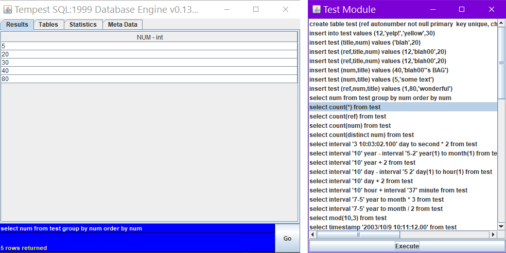

# Tempest

An Old Java Database Engine

This is a database engine written in Java 1.6 in 2004. The main file is tempest.gui.GUI. Just run it without any arguments.
This is just uploaded for historical reasons. I would rewrite a lot of it very differently now but it works for basic SQL syntax and is too interesting to gather dust on my hard disk.

